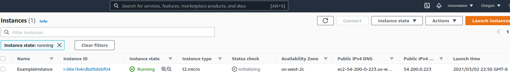

[Change Infrastructure](https://learn.hashicorp.com/tutorials/terraform/aws-change)

```text
Change line 18 in main.tf to
    ami = "ami-08d70e59c07c61a3a"
This update changes the AMI to an Ubuntu 16.04 AMI. The AWS provider knows that it cannot change the AMI of an instance 
after it has been created, so Terraform will destroy the old instance and create a new one.
```
Apply Changes

```text
$ terraform plan
$ terraform apply
aws_instance.example: Refreshing state... [id=i-043a2235b43ef2ae5]

An execution plan has been generated and is shown below.
Resource actions are indicated with the following symbols:
-/+ destroy and then create replacement

Terraform will perform the following actions:

  # aws_instance.example must be replaced
-/+ resource "aws_instance" "example" {
      ~ ami                          = "ami-830c94e3" -> "ami-08d70e59c07c61a3a" # forces replacement
      ~ arn                          = "arn:aws:ec2:us-west-2:792773549356:instance/i-043a2235b43ef2ae5" -> (known after apply)
      ~ associate_public_ip_address  = true -> (known after apply)
      ~ availability_zone            = "us-west-2c" -> (known after apply)
      ~ cpu_core_count               = 1 -> (known after apply)
      ~ cpu_threads_per_core         = 1 -> (known after apply)
      - disable_api_termination      = false -> null
      - ebs_optimized                = false -> null
      - hibernation                  = false -> null
      + host_id                      = (known after apply)
      ~ id                           = "i-043a2235b43ef2ae5" -> (known after apply)
      ~ instance_state               = "running" -> (known after apply)
      ~ ipv6_address_count           = 0 -> (known after apply)
      ~ ipv6_addresses               = [] -> (known after apply)
      + key_name                     = (known after apply)
      - monitoring                   = false -> null
      + outpost_arn                  = (known after apply)
      + password_data                = (known after apply)
      + placement_group              = (known after apply)
      ~ primary_network_interface_id = "eni-001463354fa0a4929" -> (known after apply)
      ~ private_dns                  = "ip-172-31-8-151.us-west-2.compute.internal" -> (known after apply)
      ~ private_ip                   = "172.31.8.151" -> (known after apply)
      ~ public_dns                   = "ec2-34-221-140-219.us-west-2.compute.amazonaws.com" -> (known after apply)
      ~ public_ip                    = "34.221.140.219" -> (known after apply)
      ~ secondary_private_ips        = [] -> (known after apply)
      ~ security_groups              = [
          - "default",
        ] -> (known after apply)
      ~ subnet_id                    = "subnet-28823575" -> (known after apply)
        tags                         = {
            "Name" = "ExampleInstance"
        }
      ~ tenancy                      = "default" -> (known after apply)
      ~ vpc_security_group_ids       = [
          - "sg-e1ca86cf",
        ] -> (known after apply)
        # (3 unchanged attributes hidden)

      - credit_specification {
          - cpu_credits = "standard" -> null
        }

      + ebs_block_device {
          + delete_on_termination = (known after apply)
          + device_name           = (known after apply)
          + encrypted             = (known after apply)
          + iops                  = (known after apply)
          + kms_key_id            = (known after apply)
          + snapshot_id           = (known after apply)
          + tags                  = (known after apply)
          + throughput            = (known after apply)
          + volume_id             = (known after apply)
          + volume_size           = (known after apply)
          + volume_type           = (known after apply)
        }

      ~ enclave_options {
          ~ enabled = false -> (known after apply)
        }

      + ephemeral_block_device {
          + device_name  = (known after apply)
          + no_device    = (known after apply)
          + virtual_name = (known after apply)
        }

      ~ metadata_options {
          ~ http_endpoint               = "enabled" -> (known after apply)
          ~ http_put_response_hop_limit = 1 -> (known after apply)
          ~ http_tokens                 = "optional" -> (known after apply)
        }

      + network_interface {
          + delete_on_termination = (known after apply)
          + device_index          = (known after apply)
          + network_interface_id  = (known after apply)
        }

      ~ root_block_device {
          ~ delete_on_termination = true -> (known after apply)
          ~ device_name           = "/dev/sda1" -> (known after apply)
          ~ encrypted             = false -> (known after apply)
          ~ iops                  = 0 -> (known after apply)
          + kms_key_id            = (known after apply)
          ~ tags                  = {} -> (known after apply)
          ~ throughput            = 0 -> (known after apply)
          ~ volume_id             = "vol-0df5b3b561e2a43e5" -> (known after apply)
          ~ volume_size           = 8 -> (known after apply)
          ~ volume_type           = "standard" -> (known after apply)
        }
    }

Plan: 1 to add, 0 to change, 1 to destroy.

Do you want to perform these actions?
  Terraform will perform the actions described above.
  Only 'yes' will be accepted to approve.

  Enter a value: yes

aws_instance.example: Destroying... [id=i-043a2235b43ef2ae5]
aws_instance.example: Still destroying... [id=i-043a2235b43ef2ae5, 10s elapsed]
aws_instance.example: Destruction complete after 20s
aws_instance.example: Creating...
aws_instance.example: Still creating... [10s elapsed]
aws_instance.example: Still creating... [20s elapsed]
aws_instance.example: Still creating... [30s elapsed]
aws_instance.example: Creation complete after 32s [id=i-06e1b4cdbd9debf04]

Apply complete! Resources: 1 added, 0 changed, 1 destroyed.
```
