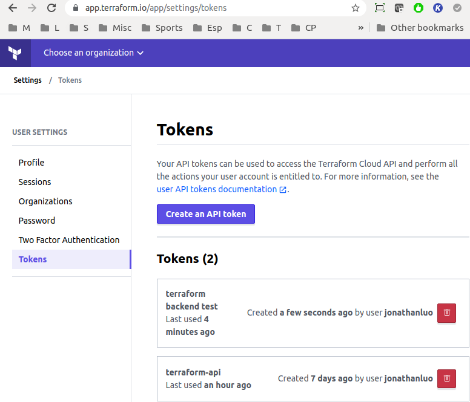
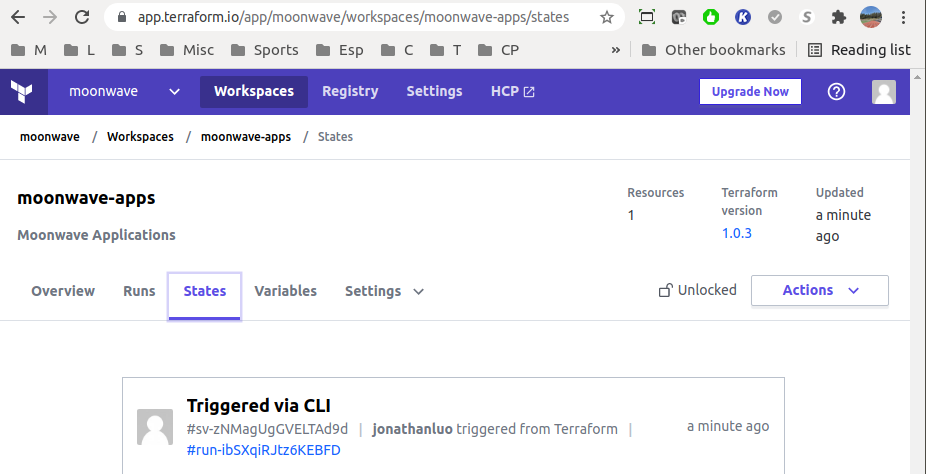
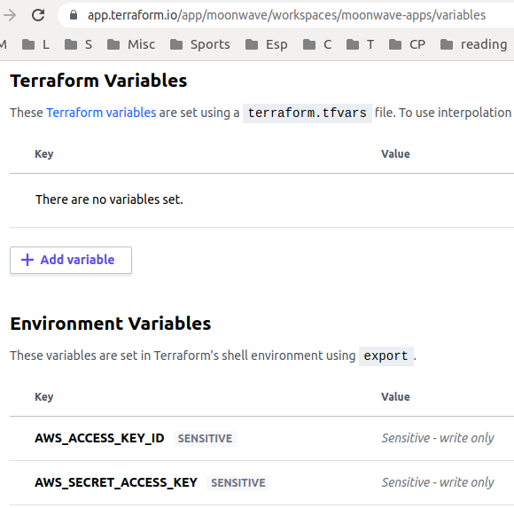

[Store Remote State](https://learn.hashicorp.com/tutorials/terraform/aws-remote?in=terraform/aws-get-started)
[Create an account at terraform](https://app.terraform.io/app/moonwave/workspaces/moonwave-apps/runs)
```text
update main.tf with the following backend "remote" contents: 
terraform {
+ backend "remote" {
+   organization = "moonwave"
+   workspaces {
+     name = "moonwave-apps"
+   }
+ }
  required_providers {
    aws = {
      source  = "hashicorp/aws"
      version = "~> 3.27"
    }
  }
}

$ terraform login  # login to terraform cloud
Generate a token using your browser, and copy-paste it into this prompt.
Terraform will store the token in plain text in the following file
for use by subsequent commands:
    /home/moonwave/.terraform.d/credentials.tfrc.json

Retrieved token for user jonathanluo

---------------------------------------------------------------------------------
                                                  --  ---------- ----------
   Welcome to Terraform Cloud!                     -  ---------- -------
                                                      ---  ----- ---
   Documentation: terraform.io/docs/cloud             --------   -

   New to TFC? Follow these steps to instantly apply an example configuration:

   $ git clone https://github.com/hashicorp/tfc-getting-started.git
   $ cd tfc-getting-started
   $ scripts/setup.sh

$ ls -l /home/moonwave/.terraform.d
total 12
-rw-rw-r-- 1 moonwave moonwave 311 Jul 29 12:43 checkpoint_cache
-rw-r--r-- 1 moonwave moonwave 394 Feb  7 22:39 checkpoint_signature
-rw------- 1 moonwave moonwave 166 Jul 29 22:52 credentials.tfrc.json

$ cat credentials.tfrc.json # see https://www.terraform.io/docs/cli/config/config-file.html#credentials
{
  "credentials": {
    "app.terraform.io": {
      "token": "5Zj ... ... Oz1o"
    }
  }
}

$ terraform init
Initializing the backend...
Do you want to copy existing state to the new backend?
  Pre-existing state was found while migrating the previous "local" backend to the
  newly configured "remote" backend. No existing state was found in the newly
  configured "remote" backend. Do you want to copy this state to the new "remote"
  backend? Enter "yes" to copy and "no" to start with an empty state.

  Enter a value: yes
  # manually unlock workspace in browser if cli failed at 
  # https://app.terraform.io/app/moonwave/workspaces/moonwave-apps/settings/lock 

Successfully configured the backend "remote"! Terraform will automatically
use this backend unless the backend configuration changes.

Initializing provider plugins...
- Reusing previous version of hashicorp/aws from the dependency lock file
- Using previously-installed hashicorp/aws v3.51.0

Terraform has been successfully initialized!

Now that Terraform has migrated the state file to Terraform Cloud, delete the local state file.
$ rm terraform.tfstate

Add two environment variables AWS_ACCESS_KEY_ID, AWS_SECRET_ACCESS_KEY and their values (from ~/.aws/credentials) 
in the "Environment Variables" section
https://app.terraform.io/app/moonwave/workspaces/moonwave-apps/variables

$ export AWS_ACCESS_KEY_ID=AKI...       # see ~/.aws/credentials
$ export AWS_SECRET_ACCESS_KEY=fuduq...

$ terraform plan
$ terraform apply
when done
$ terraform destroy
```



