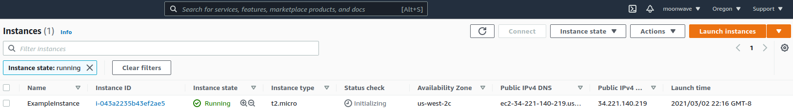

[AWS get started](https://learn.hashicorp.com/collections/terraform/aws-get-started)  
[Build Infrastructure](https://learn.hashicorp.com/tutorials/terraform/aws-build?in=terraform/aws-get-started)

```text
cat ~/.aws/credentials
$ cat > main.tf
terraform {                     # https://learn.hashicorp.com/tutorials/terraform/aws-build#terraform-block
  required_providers {
    aws = {
      source  = "hashicorp/aws" # -> registry.terraform.io/hashicorp/aws
      version = "~> 3.27"
    }
  }

  required_version = ">= 0.14.9"
}

provider "aws" {                # https://learn.hashicorp.com/tutorials/terraform/aws-build#providers
  profile = "default"
  region  = "us-west-2"
}

resource "aws_instance" "app_server" {  # https://learn.hashicorp.com/tutorials/terraform/aws-build#resources
  ami           = "ami-830c94e3"
  instance_type = "t2.micro"

  tags = {
    Name = "ExampleAppServerInstance"
  }
}

The terraform {} block is required so Terraform knows which provider to download from the Terraform Registry. 
The provider block configures the named provider, in our case aws, for creating and managing resources.
The resource block defines a piece of infrastructure.
    resource "<resource_type>" "<resource_name>" <==> resource "aws_instance" "app_server" 
```
Initialize the directory

```text
$ terraform init
Initializing the backend...

Initializing provider plugins...
- Finding hashicorp/aws versions matching "~> 3.27"...
- Installing hashicorp/aws v3.51.0...
- Installed hashicorp/aws v3.51.0 (signed by HashiCorp)
...

$ ls -la | awk '{print $9}'
main.tf
.terraform
.terraform.lock.hcl

$ tree .terraform
.terraform
└── providers
    └── registry.terraform.io
        └── hashicorp
            └── aws
                └── 3.51.0
                    └── linux_amd64
                        └── terraform-provider-aws_v3.51.0_x5
```

[Format and validate the configuration](https://learn.hashicorp.com/tutorials/terraform/aws-build?in=terraform/aws-get-started)

```text
$ terraform fmt  # remove some spaces in main.tf, run this command, the formatting will be performed on main.tf
$ terraform validate [-v]
Success! The configuration is valid.
```
[Create infrastructure](https://learn.hashicorp.com/tutorials/terraform/aws-build#create-infrastructure)

```text
$ terraform plan
$ terraform apply

Terraform used the selected providers to generate the following execution plan. Resource actions are indicated with the following symbols:
  + create

Terraform will perform the following actions:

  # aws_instance.app_server will be created
  + resource "aws_instance" "app_server" {
      + ami                                  = "ami-830c94e3"
      + arn                                  = (known after apply)
      + associate_public_ip_address          = (known after apply)
      + availability_zone                    = (known after apply)
      + cpu_core_count                       = (known after apply)
      + cpu_threads_per_core                 = (known after apply)
      + disable_api_termination              = (known after apply)
      + ebs_optimized                        = (known after apply)
      + get_password_data                    = false
      + host_id                              = (known after apply)
      + id                                   = (known after apply)
      + instance_initiated_shutdown_behavior = (known after apply)
      + instance_state                       = (known after apply)
      + instance_type                        = "t2.micro"
      + ipv6_address_count                   = (known after apply)
      + ipv6_addresses                       = (known after apply)
      + key_name                             = (known after apply)
      + monitoring                           = (known after apply)
      + outpost_arn                          = (known after apply)
      + password_data                        = (known after apply)
      + placement_group                      = (known after apply)
      + primary_network_interface_id         = (known after apply)
      + private_dns                          = (known after apply)
      + private_ip                           = (known after apply)
      + public_dns                           = (known after apply)
      + public_ip                            = (known after apply)
      + secondary_private_ips                = (known after apply)
      + security_groups                      = (known after apply)
      + source_dest_check                    = true
      + subnet_id                            = (known after apply)
      + tags                                 = {
          + "Name" = "ExampleAppServerInstance"
        }
      + tags_all                             = {
          + "Name" = "ExampleAppServerInstance"
        }
      + tenancy                              = (known after apply)
      + user_data                            = (known after apply)
      + user_data_base64                     = (known after apply)
      + vpc_security_group_ids               = (known after apply)

      + capacity_reservation_specification {
          + capacity_reservation_preference = (known after apply)

          + capacity_reservation_target {
              + capacity_reservation_id = (known after apply)
            }
        }

      + ebs_block_device {
          + delete_on_termination = (known after apply)
          + device_name           = (known after apply)
          + encrypted             = (known after apply)
          + iops                  = (known after apply)
          + kms_key_id            = (known after apply)
          + snapshot_id           = (known after apply)
          + tags                  = (known after apply)
          + throughput            = (known after apply)
          + volume_id             = (known after apply)
          + volume_size           = (known after apply)
          + volume_type           = (known after apply)
        }

      + enclave_options {
          + enabled = (known after apply)
        }

      + ephemeral_block_device {
          + device_name  = (known after apply)
          + no_device    = (known after apply)
          + virtual_name = (known after apply)
        }

      + metadata_options {
          + http_endpoint               = (known after apply)
          + http_put_response_hop_limit = (known after apply)
          + http_tokens                 = (known after apply)
        }

      + network_interface {
          + delete_on_termination = (known after apply)
          + device_index          = (known after apply)
          + network_interface_id  = (known after apply)
        }

      + root_block_device {
          + delete_on_termination = (known after apply)
          + device_name           = (known after apply)
          + encrypted             = (known after apply)
          + iops                  = (known after apply)
          + kms_key_id            = (known after apply)
          + tags                  = (known after apply)
          + throughput            = (known after apply)
          + volume_id             = (known after apply)
          + volume_size           = (known after apply)
          + volume_type           = (known after apply)
        }
    }

Plan: 1 to add, 0 to change, 0 to destroy.

Do you want to perform these actions?
  Terraform will perform the actions described above.
  Only 'yes' will be accepted to approve.

  Enter a value: yes

aws_instance.app_server: Creating...
aws_instance.app_server: Still creating... [10s elapsed]
aws_instance.app_server: Still creating... [20s elapsed]
aws_instance.app_server: Still creating... [30s elapsed]
aws_instance.app_server: Creation complete after 34s [id=i-0bfa48396f8af3778]

Apply complete! Resources: 1 added, 0 changed, 0 destroyed.
```
  
[Inspect state](https://learn.hashicorp.com/tutorials/terraform/aws-build?in=terraform/aws-get-started#inspect-state) 

When configuration applied, data wrotten into file terraform.tfstate (recommend storing this file remotely)  
Inspect the current state using:  
$ terraform show  

[Manually Managing State](https://learn.hashicorp.com/tutorials/terraform/aws-build?in=terraform/aws-get-started#manually-managing-state)  
$ terraform state list  
aws_instance.app_server
