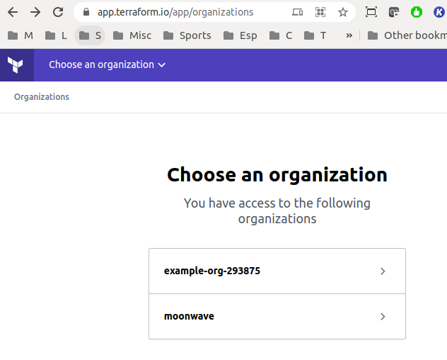
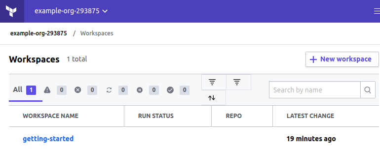
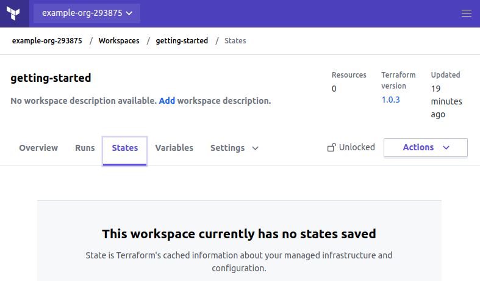
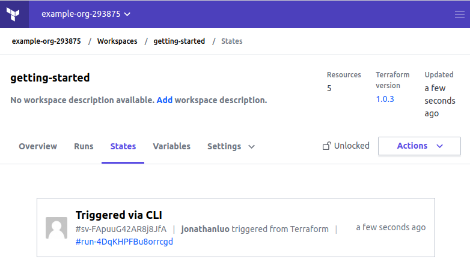
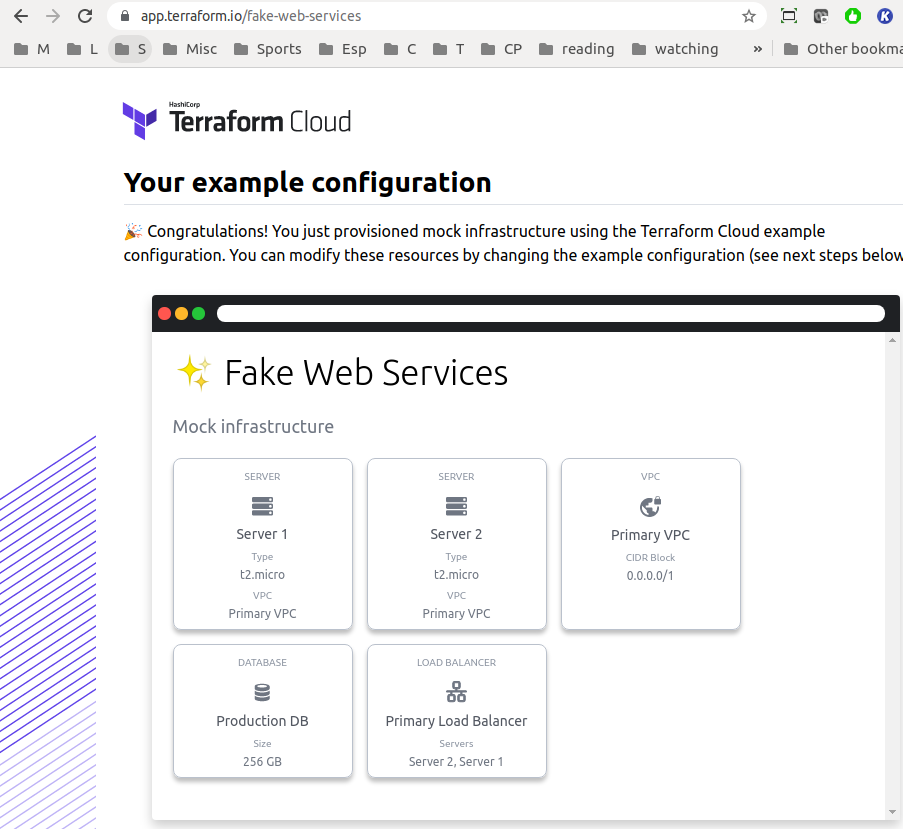
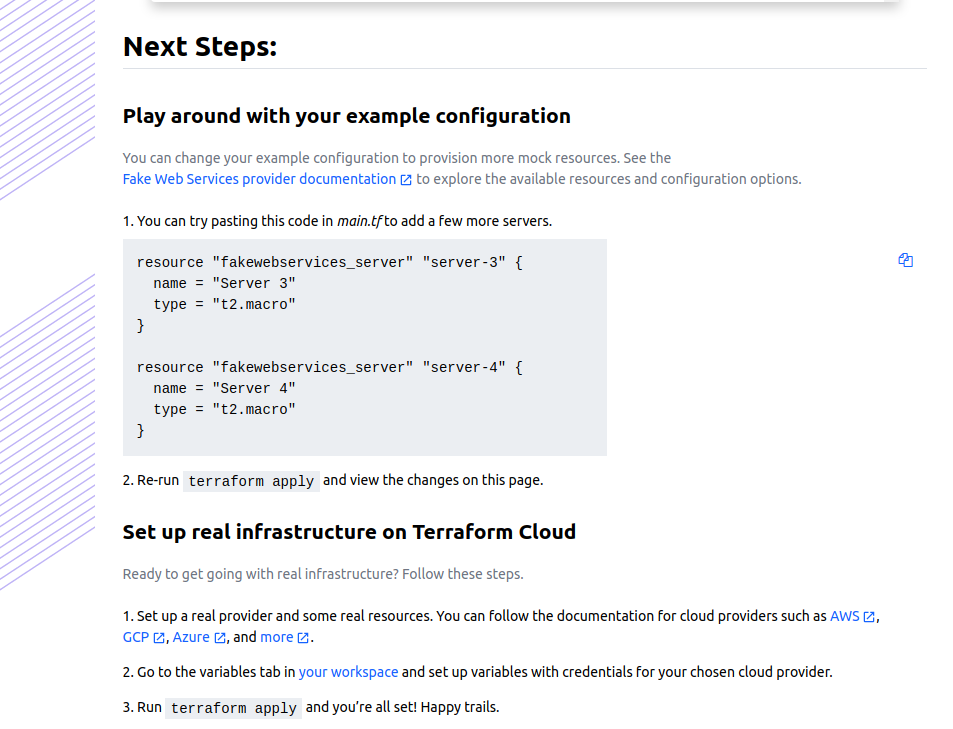

###[TFC Getting Started](git clone https://github.com/hashicorp/tfc-getting-started.git)
https://app.terraform.io/
```text
Prerequisites:
$ terraform login
credentials generated under ~/.terraform.d/ 

ls -l ~/.terraform.d/
-rw-rw-r-- 1 327 Aug  5 22:00 checkpoint_cache
-rw-r--r-- 1 394 Feb  7 22:39 checkpoint_signature
-rw------- 1 166 Aug  5 23:06 credentials.tfrc.json
```






https://app.terraform.io/fake-web-services



